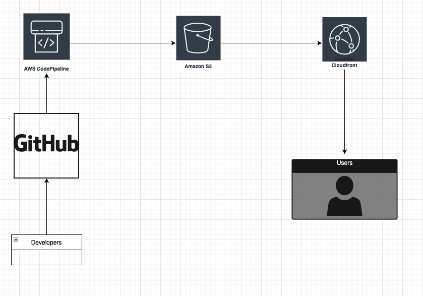

# Deploy Static site
__________

## Project Description
Our engineering team has been complaining about not having a centralized documentation platform where everyone can search for projects related
documentations, How to(s), common pitfalls and others types of documentation platform. The leadership team has tasked your manager to look for
a solution and with the help of your team architect, they have decided to host a static site on AWS s3 and use cloudfront to distribute content
to different regions where we have branches. Your manager have tasked you to do a POC on this idea to see if it is possible or not.

## Phase 1
Goal in this phase is to see if this is possible. You can do things manually without any IAC used

### POC Expectation
- We want to store our Static site in a Version Control System (The team currently uses GitHub)
- We need a resources that can take that site from GitHub and put it in S3 (Our architect mentioned Codepipeline)
- We need an S3 bucket that can host static site
- We need to connect cloudfront to the S3 bucket

### The Architectural Structure / Roadmap

### Things to Consider/ Pit hole to avoid
- Remember to give the least privilege access in the required places.
  - Codepipeline connection to GitHub (hint: Use GitHub (version 2))
  - Codepipeline connection to Static s3 bucket
  - Codepipeline connection to Artifact storage s3 (if you decided to keep artifact in a separate bucket)
  - S3 bucket to public access
  - Cloudfront connection to S3 static site
- For static website, `index.html` file must be at the root folder of the bucket
- You can get static sites from [html5](https://html5up.net/)

## Phase 2

Now that we are sure that the project is feasible, we need to make this as easy as possible to deploy. You should create your resources with IAC

## Part of the process to automate with IAC

## Deploying Static site follow through
Terraform code to deploy resources to automatically deploy static site from GitHub using codepipeline and use cloudfront to deliver content

### How to deploy the Resource
- Create codestar connections manually to the GitHub account that you intend to get code from.
  - Use GitHub version 2 in aws
  - Give access to only the repository need
  - Put in the required variables needed by terraform

#### Compulsory Variables
- aws-account
- codestar-connections-arn

### Deploying
- Run terraform init
- Run terraform plan
  - Read through the plan to confirm that expected resource will be created
- Run Terraform apply

### Room for improvement
- Create the codestar connection using terraform
- Have GitHub action do validations, formatting and output the plan of terraform code
- Setup terraform remote state to use aws s3 bucket and locking to use dynamo db
